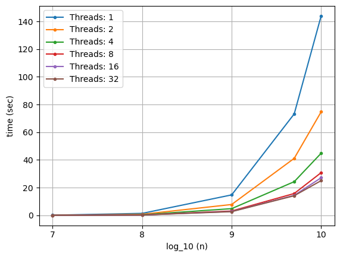
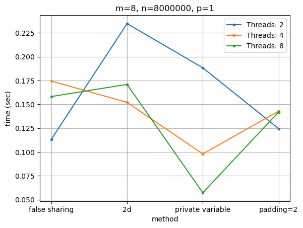
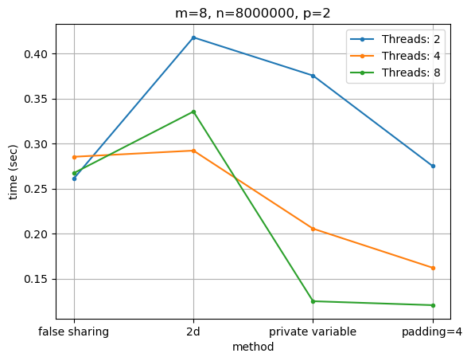
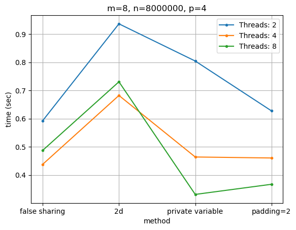

<!-- PS1='${PWD##*/} $ ' -->

# Assignment 1 - PThreads

## Authors
- `sdi2000154`: Giorgos Nikolaou
- `sdi2100203`: Helen Fili

## Exercise 1.1

### Description of the problem
In this problem, the task is to use the **Monte Carlo** method to approximate `pi` by sampling random points in a `2x2` square (centered at `(0, 0)`) and observing how many of them fall within the unit circle. We approach the problem with both serial and parallel implementations (using `PThreads`). As expected, the method produces better approximations as we increase the number of iterations, but that is not efficient when using the serial algorithm. To accelerate the computation, we utilize PThreads to parallelize the random sampling among them.

### Brief description of the solution
- **Serial**:
The serial version of the algorithm is executed when the command line argument `<threads>` is set to `1`.
- **Parallel**:
The parallel version of the algorithm is executed when the command line argument `<threads>` is greater than `1`. In this version, the samples of random points from arrow throwing are divided equally among the threads.

`approx_percentage(LONG n)`: In this function, we calculate the number of arrows that landed in the critical area (inside the unit circle). For the point sampling, a thread-safe version of `rand()` is used (`rand_r()`).

`worker(void* args)`: This function utilizes `approx_percentage()` to compute the number of arrows -that landed in the critical area- for the corresponding thread and then adds the result in the global variable `arrows`, which is guarded by a mutex.

`threaded_pi(size_t threads, LONG n)`: This functions is responsible for dividing the total number of arrows among the threads, creating and joining the threads, initializing and destroying the mutex used for sychronization and returning the approximation of `pi`.

**Implmentation Details**: type `long long` is macro-defined as `LONG`.

**Important**: The number of sampling points `<n>`, given from command line, must be divisible by the number of `<threads>`.

### Presentation of experiments and analysis
Below, we provide the results for various numbers of threads and sampling points. The horizontal axis is presented logarithmically to improve visibility.

Specifically, we executed the program with every combination of the following parameters:
- `<threads>`: `[1, 2, 4, 8, 16, 32]`
- `<n>`: `[1e7, 1e8, 1e9, 5e9, 1e10]`

To conduct this grid search and generate the corresponding plot, we developed the script `plots.py`. To reproduce, execute:
```bash
$ cd monte_carlo
$ make all
$ python ./plots.py
```

To perform manual executions, run:
```bash
$ cd monte_carlo
$ make all
$ ./monte_carlo <threads> <n>
```

Experiments were conducted locally using the following specifications:
- **OS**: `WSL: Ubuntu-22.04`
- **CPU**: `Intel(R) Core(TM) i7-9750H CPU @ 2.60GHz 2.59 GHz`, featuring `6` cores with `2` threads each.

<div style="text-align:center;">

</div>

We make the following observations:
- **Doubling** the number of threads results in **reduction** of the execution time by *half*, as expected due to the shared workload across multiple threads.
- In our configuration, featuring `6` cores with `2` threads each and totaling `12` threads (the maximum number of processor threads), we observe improvement up to the use of `12` threads. However, increasing the thread count beyond `12` does **not** yield further reductions in execution time.

## Exercise 1.2

### Description of the problem
The goal of this exercise is to implement a parallel **matrix multiplication** program using `PThreads`. An observation made after implementing the initial version of the exercise (`matmul_false_sharing.c`) was the presence of *false sharing*. **False sharing** occurs when multiple threads, running on separate cores, access different variables that happen to reside on the same cache line. To address that issue, we implemented three alternative programs (`matmul_2d.c`, `matmul_pad_var.c`, `matmul_private_var.c`).

### Brief description of the solution

#### matmul_false_sharing.c
In this implementation, we **flatten** the `2D` matrices into `1D` vectors and perform the multiplication accordingly. The total computations are divided among the threads, with each one handling the computations for a specific number of consecutive rows.

#### matmul_2d.c
Here we store the matrices as `2D` constructs, where each row is **allocated independently** in the *heap* and is handled accordingly during the multiplication.

#### matmul_pad_var.c
In this implementation, we **flatten** the `2D` matrices into `1D` vectors but insert a specified amount of **padding rows** between the actual rows in an attempt to eliminate false sharing. 

#### matmul_private_var.c
Matrices are stored in memory and handled as in `matmul_false_sharing.c`. This method differs from the previously mentioned, as it uses one local variable in the stack to calculate the sum for a specific row and column. After the sum is computed, the value is assigned to the corresponding position in the array.

**Important**: 
- The dimension `<m>`, given from command line, must be divisible by the number of `<threads>`.
- To verify the results of the multiplication, compile with `-DVERIFY`, run the desired algorithm, and then execute the script `verify.py` with the appropriate parameters (`<m> <n> <p>`).

### Presentation of experiments and analysis

Below, we provide the results for the paramaters mentioned in the assignment. For the padding method, the following pad sizes where used: `[2, 4, 8, 16]`

To perform this grid search and produce the corresponding plot, we created the script `plots.py`. To reproduce, execute:
```bash
$ cd mat_mul
$ make all
$ python ./plots.py
```

To perform manual executions, run:
```bash
$ cd mat_mul
$ make all
$ ./<algo> <m> <n> <p> <pad, when appropriate> <threads>
```

Experiments were conducted locally using the following specifications:
- **OS**: `WSL: Ubuntu-22.04`
- **CPU**: `Intel(R) Core(TM) i7-9750H CPU @ 2.60GHz 2.59 GHz`, which has `6` cores with `2` threads each.

#### Performance

Regardless of dimension sizes and the number of threads, the methods, ranked from slowest to fastest on average, are: `2D < false sharing < private variable < padding`

#### Dimensions: $m = n = 8000, p = 1/2/4/8/80$ 

It is evident that the effect of any possible false sharing is negligible across all padding sizes and for all values of `p`.

<div style="text-align:center;">

</div>

<div style="text-align:center;">

</div>

#### Dimensions: $m = 8, n = 8000000, p = 1/2$ 

In this case, false sharing is noticeable. Upon examining the plots, we observe the following:
- **False Sharing**: As expected, this naive approach exhibits a substantial amount of false sharing.  
- **2D**: Surprisingly, this method did not eliminate false sharing for all parameter combinations. Specifically, for $p=1$ and $p=2$, false sharing can be noticed when utilizing `8` threads. Additionally, this approach is slower and, therefore, **not** a good choice.
- **Private Variable**: This method is perhaps the simplest solution to make false sharing negligible. It works for every combination of parameters.
- **Padding**: This method also eliminates false sharing. **Note**: In some plots, it appears that there is false sharing, but this can be attributed to the system performing more tasks in the background.


<div style="text-align:center;">


</div>

#### Dimensions: $m = 8, n = 8000000, p = 4/8$ 

For this combinations of parameters, no false sharing is noticeable.


<div style="text-align:center;">


</div>

## Exercise 1.3

### Description of the problem
The task of this exercise is to implement our own *read-write* locks to control the respective threads. We need to implement two approaches: locks where *priority* is given to **reading** threads and locks where *priority* is given to **writing** threads. A linked list program from the provided book -which utilizes `Pthread` read-write locks- is provided for modification to incorporate our custom locks.

### Brief description of the solution

### Presentation of experiments and analysis

